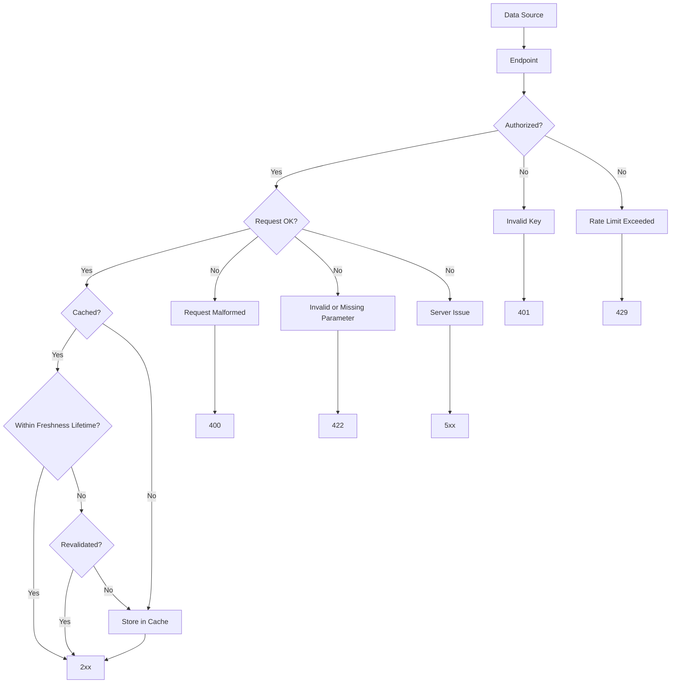
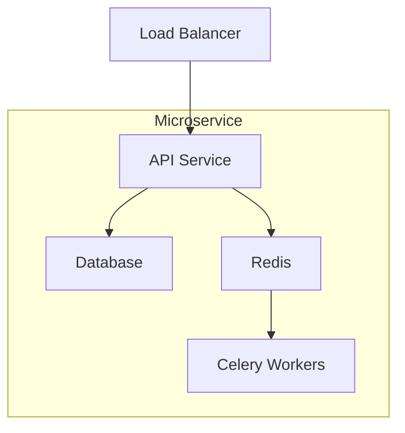
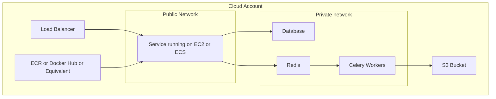

# API Design
This design is to serve as a prototype. Meaning it is NOT production
ready and shouldn't be used in a production environment.  There are a 
lot of features not implemented and should only serve as a starting point.

## API Structure
The API should function a bit like the following:

## Infrastructure
A basic understanding of how this could work is as follows:

If hosting on AWS, the implementation could look something like this:
